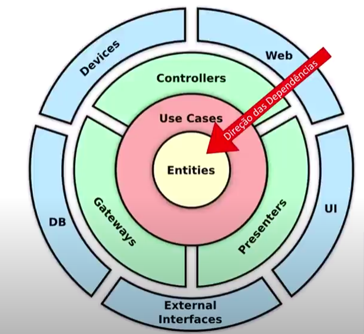

# Clean Architecture

- Described by Robert C. Martin in his book "Clean Architecture: A Craftsman's Guide to Software Structure and Design" - 2012.
- Follows the principles of SOLID, which are:
  - **S**: Single Responsibility Principle
  - **O**: Open/Closed Principle
  - **L**: Liskov Substitution Principle
  - **I**: Interface Segregation Principle
  - **D**: Dependency Inversion Principle
- Aims to create systems that are loosely coupled, highly cohesive, and easy to maintain.
- 

## Principles

- **Dependency Rule**: Source code dependencies must point inward, toward higher-level policies.
- **Abstraction**: High-level modules should not depend on low-level modules. Both should depend on abstractions.
- **Reuse/Release Equivalence Principle (REP)**: The granule of reuse is the granule of release. If different parts of the system are reused together, they should be released together, including its changes.
- **Common Closure Principle (CCP)**: Classes that change together should be packaged together.
- **Common Reuse Principle (CRP)**: Classes that are reused together should be packaged together.
- **Acyclic Dependencies Principle (ADP)**: The dependency graph of the system should be acyclic. This means that there should be no circular dependencies between modules.
- **Stable Dependencies Principle (SDP)**: Depend on the stability of the modules. More stable modules should not depend on less stable modules.
- **Stable Abstractions Principle (SAP)**: The more stable a module is, the more abstract it should be. This means that stable modules should not depend on concrete implementations but rather on abstractions.
