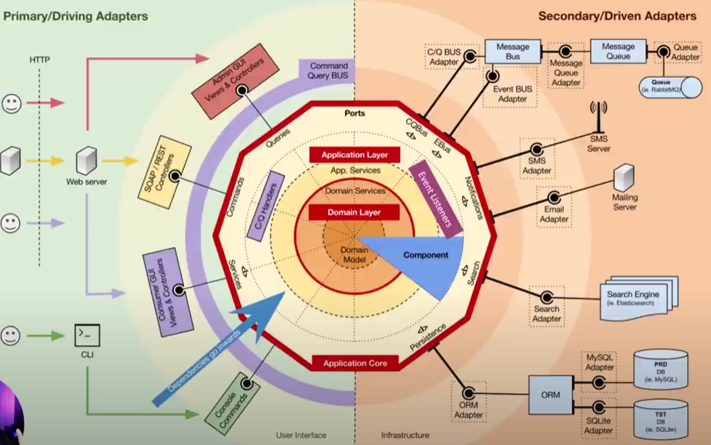

# Hexagonal Architecture

- Described by Alistair Cockburn in his book "Hexagonal Architecture" - 2005.
- Also known as Ports and Adapters Architecture.
- Aims to create systems that are independent of external frameworks, libraries, and technologies.
- It's based on the idea of separating the core business logic from the external concerns, such as user interfaces, databases, and external services.
- 
