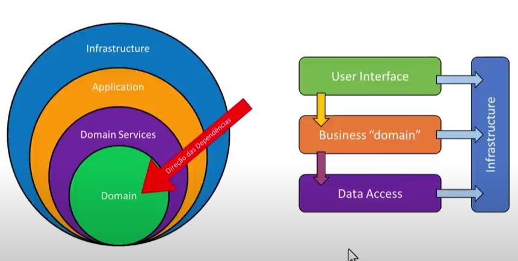

# Onion Architecture

- Described by Jeffrey Palermo in his blog post "Onion Architecture" - 2008.
- Aims to address the limitations of traditional layered architectures by emphasizing the separation of concerns and the independence of the core business logic from external concerns.
- It's based on:
  - SOLID principles
  - Good practices of OOP (Object-Oriented Programming)
  - Uses Inversion of Control (IoC) to achieve cyclic dependencies and loose coupling between layers/objects.
- 
